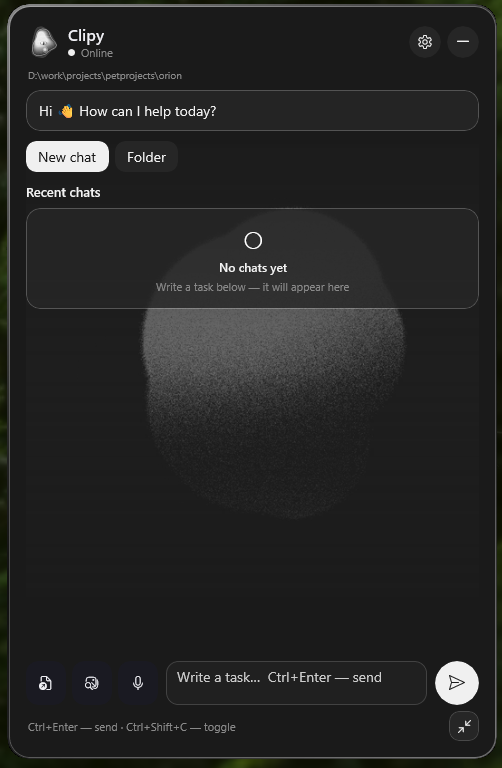

# Clipy

Windows desktop assistant in the spirit of Clippy. Talks to AI agent CLIs from a floating mascot + chat panel — without opening the full IDE.

<p align="center">
  
</p>

<p align="center">
  
</p>

## Features

- Always-on-top floating mascot (orb) and expandable chat panel
- **Cursor Agent**, **OpenAI Codex**, and **Claude Code** CLI adapters
- Streaming replies with stop/cancel
- Local chat history with session list, resume, and delete
- Agent / Ask / Plan modes
- One-sentence summary bubble near mascot when panel is collapsed
- Copy full answers and fenced code blocks
- Voice input (Windows speech recognition → text)
- Mascot reaction states on the orb (thinking / success / error)
- Themes: **Neon**, **Totoro Forest**, **Grain Mono** with animated mascots
- Ukrainian / English UI
- Attachments: files, folders, clipboard images, screenshots
- Model picker, global hotkeys, tray icon, auto-updates

## Requirements

- Windows 10 1809+ / Windows 11
- [.NET 8 SDK](https://dotnet.microsoft.com/download/dotnet/8.0) (or newer with roll-forward)
- At least one agent CLI installed and logged in:
  - [Cursor Agent CLI](https://cursor.com/docs/cli/installation)
  - [OpenAI Codex CLI](https://github.com/openai/codex)
  - [Claude Code CLI](https://docs.anthropic.com/en/docs/claude-code)

## Build & run

```powershell
.\install.ps1
```

Self-contained publish output: `publish/Clipy.exe`

### Installer (for releases)

Build a Windows installer + portable zip:

```powershell
.\build-installer.ps1
```

Outputs in `dist/`:

- `Clipy-Setup-<version>-x64.exe` — installer (Start Menu, uninstaller, optional autostart)
- `Clipy-<version>-win-x64-portable.zip` — portable build without installer

Requires [Inno Setup 6](https://jrsoftware.org/isinfo.php) (`winget install JRSoftware.InnoSetup`).  
Portable zip only (no Inno):

```powershell
.\build-installer.ps1 -PortableOnly
```

GitHub Release: push a tag `v1.1.0` — workflow `.github/workflows/release.yml` builds and uploads both artifacts.

Autostart (optional):

```powershell
.\install.ps1 -RegisterAutostart
```

Start an already-built build:

```powershell
.\start.ps1
```

## Config

Saved at `%APPDATA%\ClipyAssistant\config.json`:

- `workspace` — agent working folder
- `agent_provider` — `cursor` | `codex` | `claude`
- `theme_id` — `default` | `kawaii` | `grain`
- `model_id` — e.g. `auto`, `composer-2.5`
- `agent_mode` — `agent` | `ask` | `plan`
- `local_session_id` / `chat_id` — local history + agent resume id
- `recent_workspaces` — last folders (up to 5)
- window position

## Project layout

```
Clipy/           WinUI 3 app source
docs/            README screenshot and mascot GIF
installer/       Inno Setup script (Clipy.iss)
tools/           IconGen, MascotGifGen
build-installer.ps1  publish + Setup.exe + portable zip
install.ps1      quick publish + launch
start.ps1        launch existing publish
generate-icons.ps1
generate-readme-assets.ps1
```

## Notes

- The orb uses a separate layered Win32 window for real transparency.
- Regenerate README media: `.\generate-readme-assets.ps1` (GIF); replace `docs/screenshot.png` manually when the UI changes.
